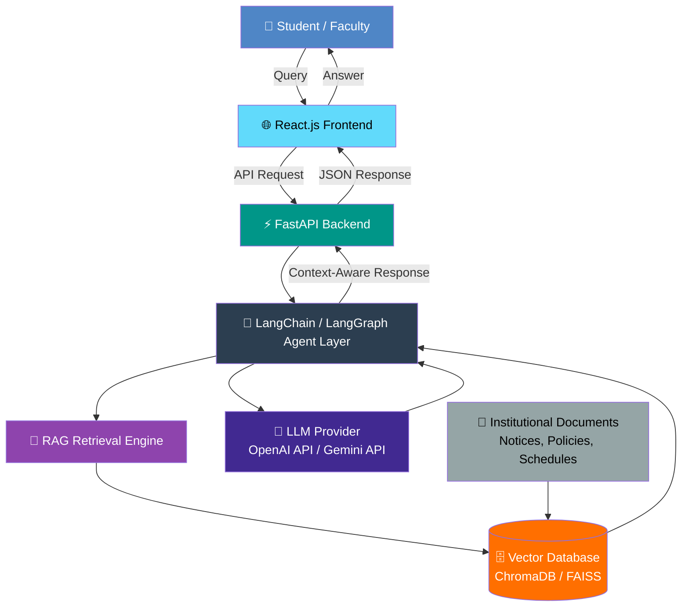

<div align="center">

# 🎓 CampusGenie AI With ERP 

### *AI for Smarter Learning*

**An AI-powered academic assistant built with LLMs, RAG, and Agentic AI for intelligent, context-aware access to university information and academic services.**

[](#)
[](#)
[](#-license)
[](#)

[](#)
[](#)
[](#)
[](#)
[](#)
[](#)
[](#)
[](#)
[](#)

</div>

---

## 📖 Table of Contents

- [About the Project](#-about-the-project)
- [Problem Statement](#-problem-statement)
- [Objectives](#-objectives)
- [Proposed Solution](#-proposed-solution)
- [Key Features](#-key-features)
- [System Architecture](#-system-architecture)
- [Tech Stack](#-tech-stack)
- [Project Structure](#-project-structure)
- [Getting Started](#-getting-started)
- [Usage](#-usage)
- [Roadmap](#-roadmap)
- [Team](#-team)
- [Mentor](#-mentor)
- [Contributing](#-contributing)
- [License](#-license)
- [Contact](#-contact)

---

## 🧭 About the Project

> **CampusGenie AI** is an intelligent academic assistant designed to simplify how students and faculty access institutional knowledge. By combining **Large Language Models (LLMs)**, **Retrieval-Augmented Generation (RAG)**, and **Agentic AI workflows**, CampusGenie delivers accurate, conversational, and context-aware answers to everyday academic queries — from class schedules to placement updates.

| 🏷️ Attribute | 📋 Details |
|---|---|
| **Team Name** | CYC — *Control Your Career* |
| **Team ID** | 26O4043 |
| **Category** | University Problem Statement |
| **Status** | ✅ Approved |
| **Repository** | [`BHANUASATI/CampusGenie-AI`](https://github.com/BHANUASATI/CampusGenie-AI) |

---

## ❗ Problem Statement

<table>
<tr>
<td>

Universities generate a huge volume of scattered information — timetables, notices, attendance records, placement updates, and policy documents — that students struggle to search and interpret efficiently. Traditional portals are static, non-conversational, and require manual navigation across multiple systems.

**CampusGenie AI** addresses this gap by providing an **AI-powered academic assistant** that leverages **LLMs**, **RAG**, and **AI Agents** to deliver accurate, context-aware, and conversational responses — simplifying access to institutional knowledge while offering a scalable platform for future intelligent academic services.

</td>
</tr>
</table>

---

## 🎯 Objectives

- 🤖 Develop an **AI-powered academic assistant** using LLMs, RAG, and Agentic AI.
- 🔍 Build a **knowledge retrieval system** capable of understanding and answering natural language queries accurately.
- 🧪 Gain hands-on experience in **AI application development**, conversational interfaces, and intelligent information retrieval.

---

## 💡 Proposed Solution

<table>
<tr>
<td width="33%" align="center" valign="top">

### 💬 Conversational Assistant
An AI-powered academic assistant capable of answering queries related to **courses, schedules, notices, attendance, placements**, and **university policies**.

</td>
<td width="33%" align="center" valign="top">

### 📚 RAG Knowledge Engine
A **RAG-based retrieval system** integrated with institutional documents for accurate, context-aware, and up-to-date responses.

</td>
<td width="33%" align="center" valign="top">

### 🌐 Smart Web Application
A user-friendly web app supporting conversational AI, with future-ready features like **voice interaction, document summarization, assignment assistance**, and **personalized recommendations**.

</td>
</tr>
</table>

---

## ✨ Key Features

| Icon | Feature | Description |
|:---:|---|---|
| 🗣️ | **Conversational Q&A** | Natural language chat interface for academic queries |
| 📖 | **RAG-Powered Answers** | Context-aware responses grounded in real institutional documents |
| 🧠 | **Agentic AI Workflows** | Multi-step reasoning agents (via LangGraph) for complex tasks |
| 🗂️ | **Institutional Knowledge Base** | Vector-indexed documents (policies, notices, schedules) |
| 🎙️ | **Voice Interaction** *(Planned)* | Speak your queries instead of typing |
| 📝 | **Document Summarization** *(Planned)* | Quick summaries of long academic documents |
| 🎓 | **Assignment Assistance** *(Planned)* | AI-guided help for academic tasks |
| 🎯 | **Personalized Recommendations** *(Planned)* | Tailored academic and placement suggestions |

---

## 🏗️ System Architecture



**Flow Summary:**
1. The **frontend (React.js)** captures the user's natural language query.
2. The **FastAPI backend** routes the request to the AI agent layer.
3. **LangChain/LangGraph agents** orchestrate reasoning and decide whether retrieval is needed.
4. The **RAG engine** fetches relevant chunks from the **vector database** (ChromaDB/FAISS), which is populated from institutional documents.
5. The **LLM** (OpenAI/Gemini) synthesizes a final, context-grounded answer.
6. The response flows back to the user through the web interface.

---

## 🛠️ Tech Stack

<div align="center">

| Layer | Technology |
|---|---|
| **Frontend** |  |
| **Backend** |   |
| **AI Orchestration** |   |
| **LLM Providers** |   |
| **Retrieval** | Retrieval-Augmented Generation (RAG) |
| **Vector Database** |   |

</div>

---

## 📁 Project Structure

```
CampusGenie-AI/
├── backend/
│   ├── app/
│   │   ├── agents/            # LangGraph agent definitions
│   │   ├── rag/                # RAG pipeline & retrieval logic
│   │   ├── models/             # Pydantic schemas
│   │   ├── routes/             # FastAPI route handlers
│   │   └── main.py             # FastAPI entry point
│   ├── vector_store/            # ChromaDB / FAISS index files
│   ├── requirements.txt
│   └── .env.example
├── frontend/
│   ├── src/
│   │   ├── components/          # React UI components
│   │   ├── pages/               # App pages/views
│   │   ├── services/            # API service calls
│   │   └── App.jsx
│   ├── package.json
│   └── .env.example
├── docs/                        # Documentation & diagrams
├── data/                        # Institutional documents (source data)
├── LICENSE
└── README.md
```

---

## 🚀 Getting Started

### ✅ Prerequisites

- Python **3.10+**
- Node.js **18+** and npm
- An **OpenAI API Key** or **Gemini API Key**

### 📥 Installation

```bash
# 1. Clone the repository
git clone https://github.com/BHANUASATI/CampusGenie-AI.git
cd CampusGenie-AI

# 2. Set up the backend
cd backend
python -m venv venv
source venv/bin/activate   # On Windows: venv\Scripts\activate
pip install -r requirements.txt
cp .env.example .env       # Add your API keys here

# 3. Set up the frontend
cd ../frontend
npm install
cp .env.example .env
```

### ▶️ Running the Application

```bash
# Start the backend (from /backend)
uvicorn app.main:app --reload

# Start the frontend (from /frontend)
npm run dev
```

The app will be available at:
- **Frontend:** `http://localhost:5173`
- **Backend API:** `http://localhost:8000`
- **API Docs (Swagger):** `http://localhost:8000/docs`

---

## 💻 Usage

1. Open the web app in your browser.
2. Type a natural language question — e.g. *"What is my attendance percentage?"* or *"When is the next placement drive?"*
3. CampusGenie AI retrieves relevant institutional data and generates a context-aware response.
4. Continue the conversation for follow-up questions — the assistant maintains context across the session.

---

## 🗺️ Roadmap

- [x] Core RAG-based Q&A engine
- [x] Web-based conversational interface
- [ ] Voice interaction support
- [ ] Document summarization module
- [ ] Assignment assistance agent
- [ ] Personalized academic & placement recommendations
- [ ] Mobile application (Android)

---

## 👥 Team

<div align="center">

### Team CYC — *Control Your Career*

| Role | Name | Program | ID | Contact |
|---|---|---|---|---|
| 🧑‍💼 **Team Leader** | Bhanu Asati | MCA - A | 2501560014 | 📧 2501560014@krmu.edu.in <br> 📞 7354336191 |
| 👩‍💻 **Member** | Srashti Dwivedi | MCA - A | 2501560012 | 📧 2501560012@krmu.edu.in <br> 📞 7982346685 |

</div>

## 🧑‍🏫 Mentor

| Role | Name |
|---|---|
| **Internal Mentor** | Mr. Vishwanil Suman |

---

## 🤝 Contributing

Contributions are welcome! To contribute:

1. **Fork** this repository
2. Create a new branch (`git checkout -b feature/your-feature-name`)
3. Commit your changes (`git commit -m "Add your feature"`)
4. Push to the branch (`git push origin feature/your-feature-name`)
5. Open a **Pull Request**

Please make sure to update tests and documentation as appropriate.

---

## 📄 License

This project is licensed under the **MIT License** — see the [LICENSE](LICENSE) file for details.

---

## 📬 Contact

<div align="center">

**Project maintained by Team CYC**

[](https://github.com/BHANUASATI/CampusGenie-AI)

For queries, reach out via the emails listed in the [Team](#-team) section above.

---

⭐ **If you find this project useful, consider giving it a star!** ⭐

</div>
