# CampusGenie-AI System Architecture Diagrams

## HIGH-LEVEL SYSTEM ARCHITECTURE

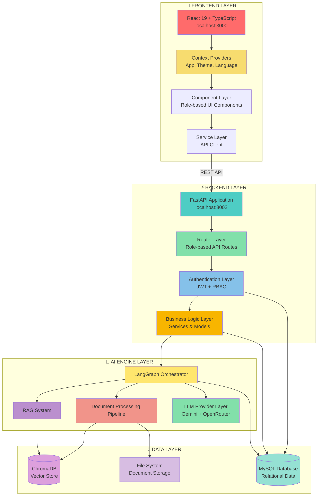

## DETAILED FRONTEND ARCHITECTURE

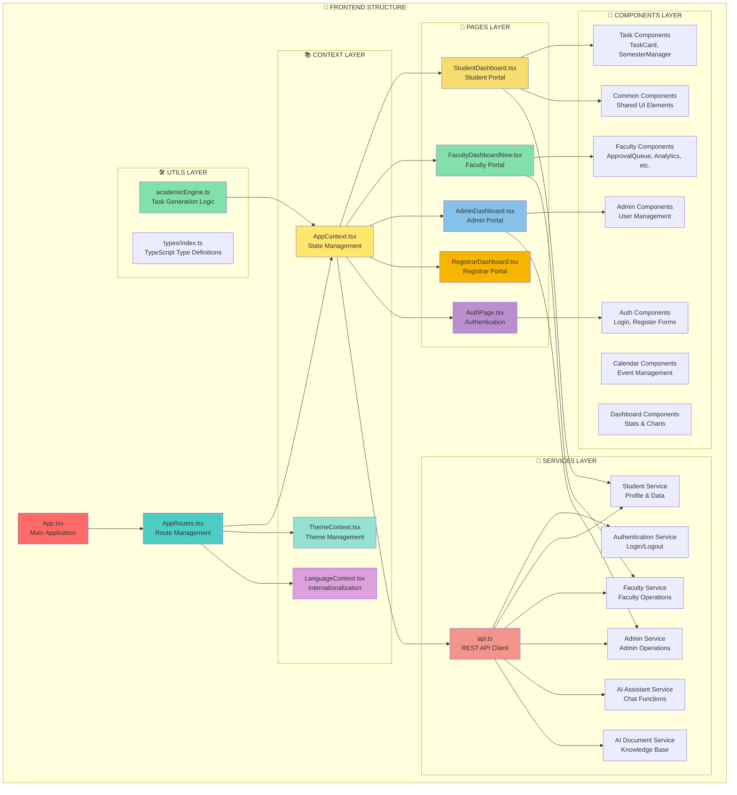

## DETAILED BACKEND ARCHITECTURE

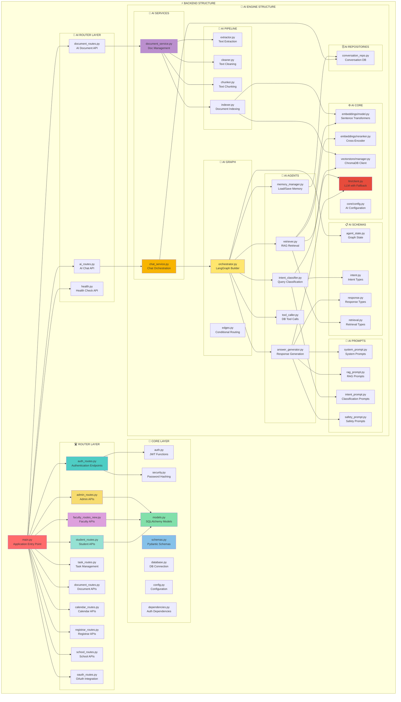

## DATABASE SCHEMA ARCHITECTURE

```mermaid
graph TB
    subgraph "🗄️ DATABASE STRUCTURE"
        subgraph "👥 USER HIERARCHY"
            Users[users<br/>Base Authentication Table]
            Students[students<br/>Student Profile Data]
            Faculties[faculties<br/>Faculty Profile Data]
            Admins[admins<br/>Admin Profile Data]
        end
        
        subgraph "🏫 ORGANIZATIONAL STRUCTURE"
            Schools[schools<br/>University Schools]
            Departments[departments<br/>Academic Departments]
            Courses[courses<br/>Academic Courses]
        end
        
        subgraph "📄 DOCUMENT MANAGEMENT"
            DocumentTypes[document_types<br/>Document Categories]
            StudentDocuments[student_documents<br/>Uploaded Documents]
        end
        
        subgraph "📋 TASK MANAGEMENT"
            Tasks[tasks<br/>Assigned Tasks]
            TaskSubmissions[task_submissions<br/>Student Submissions]
        end
        
        subgraph "🤖 AI SYSTEM"
            AIConversations[ai_conversations<br/>Chat Sessions]
            AIMessages[ai_messages<br/>Chat Messages]
        end
        
        subgraph "⚙️ SYSTEM MANAGEMENT"
            AuditLogs[audit_logs<br/>Action History]
            Notifications[notifications<br/>User Notifications]
        end
    end
    
    Users --> Students
    Users --> Faculties
    Users --> Admins
    
    Schools --> Departments
    Departments --> Courses
    Departments --> Students
    Departments --> Faculties
    Departments --> Tasks
    
    Students --> StudentDocuments
    Students --> Tasks
    Students --> TaskSubmissions
    
    DocumentTypes --> StudentDocuments
    
    Faculties --> Tasks
    Faculties --> StudentDocuments
    Faculties --> TaskSubmissions
    
    Tasks --> TaskSubmissions
    
    Users --> AIConversations
    AIConversations --> AIMessages
    
    Users --> AuditLogs
    Users --> Notifications
    
    Courses --> Students
    
    style Users fill:#E74C3C
    style Students fill:#27AE60
    style Faculties fill:#F39C12
    style Admins fill:#8E44AD
    style Schools fill:#3498DB
    style Departments fill:#16A085
    style Courses fill:#2ECC71
    style DocumentTypes fill:#E67E22
    style StudentDocuments fill:#D35400
    style Tasks fill:#C0392B
    style TaskSubmissions fill:#9B59B6
    style AIConversations fill:#1ABC9C
    style AIMessages fill:#34495E
    style AuditLogs fill:#7F8C8D
    style Notifications fill:#95A5A6
```

## AI ENGINE PROCESSING FLOW

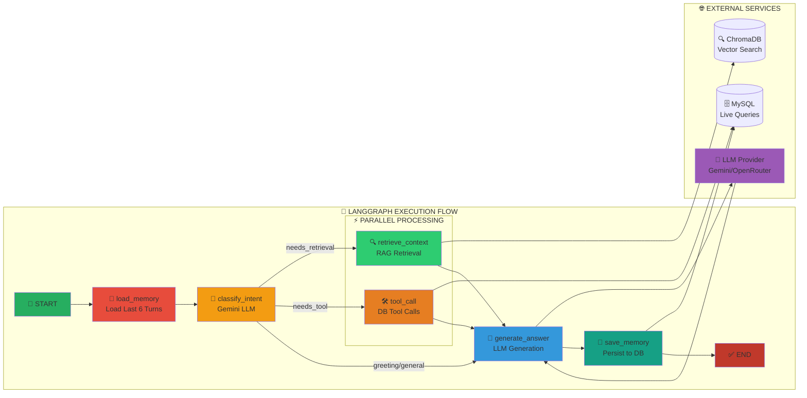

## DATA FLOW ARCHITECTURE

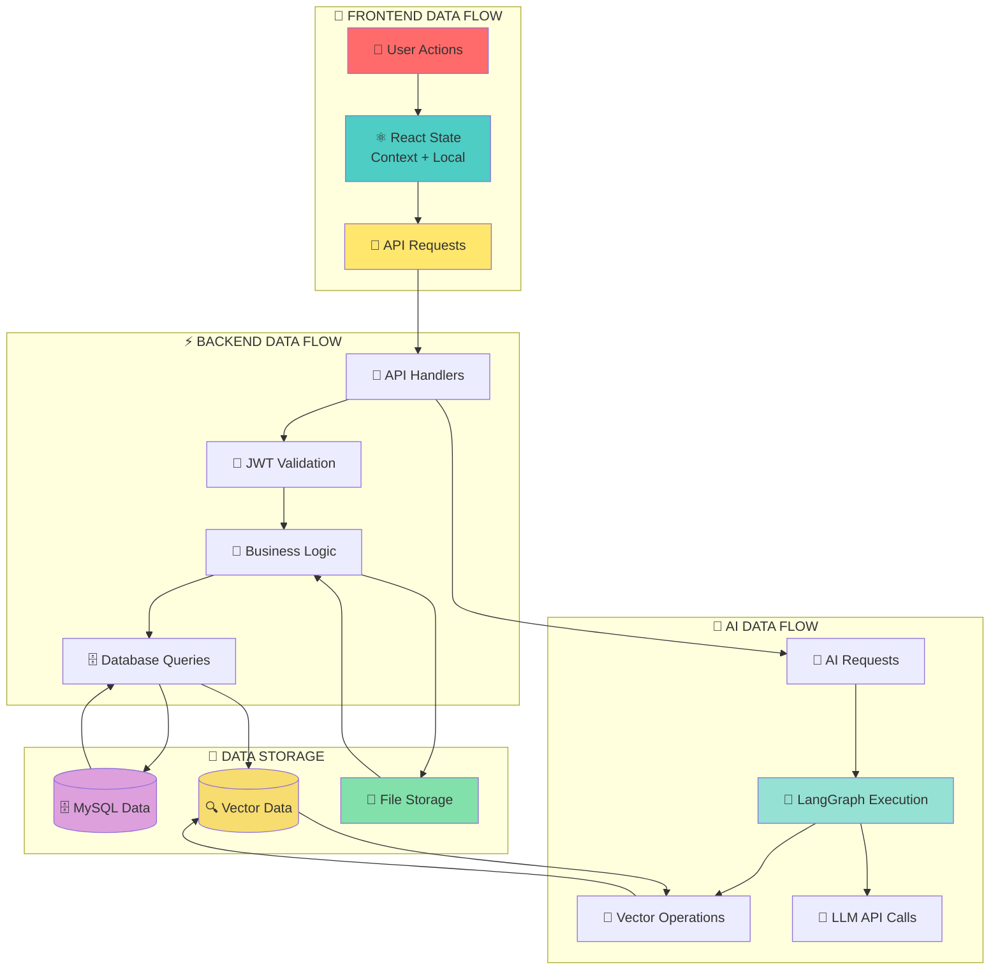

## SECURITY & AUTHENTICATION FLOW

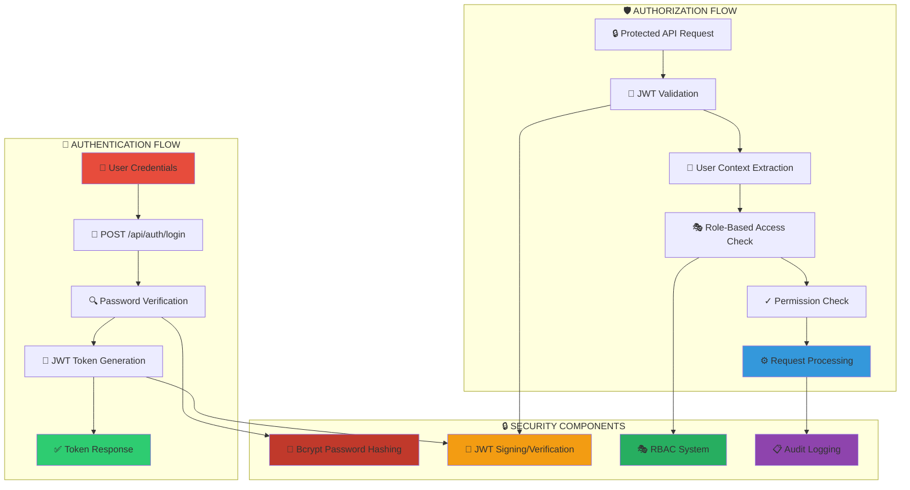

## DOCUMENT PROCESSING PIPELINE

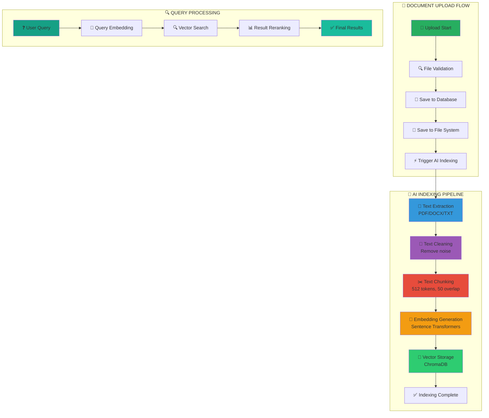

## MULTI-ROLE PORTAL ARCHITECTURE

```mermaid
graph TB
    subgraph "🎨 STUDENT PORTAL"
        S1[📤 Upload Documents]
        S2[📊 View Grades & GPA]
        S3[📅 Check Timetable]
        S4[🤖 Chat with AI Assistant]
        S5[📋 View Tasks & Deadlines]
        S6[👤 Profile Management]
    end
    
    subgraph "👨‍🏫 FACULTY PORTAL"
        F1[✅ Verify Documents]
        F2[📊 View Student Records]
        F3[📅 Manage Timetables]
        F4[📝 Create & Grade Tasks]
        F5[📈 Track Attendance]
        F6[📊 Faculty Analytics]
    end
    
    subgraph "👨‍💼 ADMIN PORTAL"
        A1[👥 User Management]
        A2[🏫 Course Setup]
        A3[🔧 System Configuration]
        A4[📊 Analytics Dashboard]
        A5[📚 Document Types Setup]
        A6[🔐 Role Management]
    end
    
    subgraph "👨‍⚖️ REGISTRAR PORTAL"
        R1[📊 Full Oversight]
        R2[📈 Analytics & Reports]
        R3[🔧 Bulk Operations]
        R4[👥 All User Management]
        R5[🏫 Academic Oversight]
        R6[📋 System Reports]
    end
    
    subgraph "🤖 SHARED AI FEATURES"
        AI1[💬 AI Chat Interface]
        AI2[🔍 Knowledge Base Search]
        AI3[📊 AI Analytics]
    end
    
    S4 --> AI1
    F1 --> DB[(🗄️ MySQL)]
    A1 --> DB
    R1 --> DB
    
    AI1 --> AI2
    AI2 --> AI3
    
    style S1 fill:#3498DB
    style F1 fill:#E74C3C
    style A1 fill:#27AE60
    style R1 fill:#9B59B6
    style AI1 fill:#F39C12
    style DB fill:#95A5A6
```

## API ENDPOINT ARCHITECTURE

```mermaid
graph TB
    subgraph "🔌 AUTHENTICATION APIS"
        AuthLogin[POST /api/auth/login<br/>User Login]
        AuthRegister[POST /api/auth/register<br/>User Registration]
        AuthMe[GET /api/auth/me<br/>Get Current User]
        AuthLogout[POST /api/auth/logout<br/>User Logout]
    end
    
    subgraph "👨‍🎓 STUDENT APIS"
        StudentProfile[GET /students/me<br/>Student Profile]
        StudentDashboard[GET /students/dashboard/stats<br/>Dashboard Stats]
        StudentDocs[GET /documents/my-documents-status<br/>Document Status]
        StudentTasks[GET /tasks<br/>Student Tasks]
        StudentSubmit[POST /tasks/{id}/submit<br/>Submit Task]
    end
    
    subgraph "👨‍🏫 FACULTY APIS"
        FacultyProfile[GET /faculty/simple/me<br/>Faculty Profile]
        FacultyDashboard[GET /faculty/dashboard/stats<br/>Dashboard Stats]
        FacultyPending[GET /faculty/documents/pending<br/>Pending Documents]
        FacultyVerify[PUT /faculty/documents/{id}/verify<br/>Verify Document]
        FacultyGrade[PUT /tasks/submissions/{id}/grade<br/>Grade Submission]
    end
    
    subgraph "👨‍💼 ADMIN APIS"
        AdminStats[GET /admin/stats<br/>System Statistics]
        AdminUsers[GET /admin/users<br/>User Management]
        AdminCreateUser[POST /admin/users<br/>Create User]
        AdminDepartments[GET /admin/departments<br/>Department Management]
        AdminAudit[GET /admin/audit/logs<br/>Audit Logs]
    end
    
    subgraph "🤖 AI APIS"
        AIConversations[GET /api/ai/conversations<br/>List Conversations]
        AICreateChat[POST /api/ai/conversations<br/>Create Conversation]
        AISendMessage[POST /api/ai/conversations/{id}/messages<br/>Send Message]
        AIQuickChat[POST /api/ai/chat<br/>Quick Chat]
        AIHealth[GET /api/ai/health<br/>Health Check]
        AIDocUpload[POST /api/ai/documents/upload<br/>Upload Knowledge Doc]
        AIDocList[GET /api/ai/documents<br/>List Documents]
    end
    
    subgraph "📅 CALENDAR APIS"
        CalendarEvents[GET /calendar/events<br/>Get Events]
        CalendarCreate[POST /calendar/events<br/>Create Event]
        CalendarUpdate[PUT /calendar/events/{id}<br/>Update Event]
        CalendarAcademic[GET /calendar/academic-events<br/>Academic Events]
    end
    
    subgraph "📄 DOCUMENT APIS"
        DocTypes[GET /documents/types<br/>Document Types]
        DocUpload[POST /documents/upload<br/>Upload Document]
        DocStudent[GET /documents/student/{id}<br/>Student Documents]
        DocDelete[DELETE /documents/{id}<br/>Delete Document]
    end
    
    style AuthLogin fill:#E74C3C
    style StudentProfile fill:#3498DB
    style FacultyProfile fill:#E67E22
    style AdminStats fill:#27AE60
    style AIConversations fill:#9B59B6
    style CalendarEvents fill:#16A085
    style DocUpload fill:#D35400
```

## COMPONENT COMMUNICATION FLOW

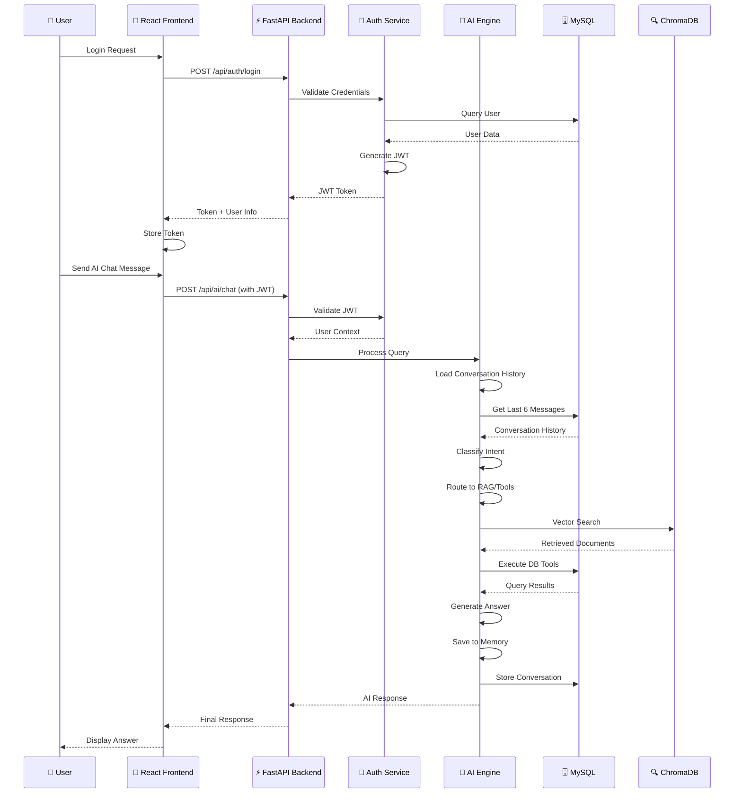

## ERROR HANDLING & RECOVERY FLOW

```mermaid
graph TB
    subgraph "🔄 ERROR HANDLING SYSTEM"
        IncomingRequest[📥 Incoming Request]
        TryExecution[🎯 Try Execution]
        
        subgraph "❌ ERROR DETECTION"
            ValidationError[📝 Validation Error]
            AuthError[🔐 Authentication Error]
            DatabaseError[🗄️ Database Error]
            AIError[🤖 AI Error]
            NetworkError[🌐 Network Error]
        end
        
        subgraph "🛠️ RECOVERY STRATEGIES"
            RetryLogic[🔄 Retry Logic]
            FallbackStrategy[🔄 Fallback Strategy]
            GracefulDegradation[🛡️ Graceful Degradation]
        end
        
        subgraph "📧 ERROR NOTIFICATION"
            LogError[📝 Log Error]
            NotifyUser[📧 Notify User]
            AlertAdmin[🚨 Alert Admin]
        end
        
        SuccessResponse[✅ Success Response]
        ErrorResponse[❓ Error Response]
    end
    
    IncomingRequest --> TryExecution
    
    TryExecution -->|Success| SuccessResponse
    TryExecution -->|Error| ValidationError
    TryExecution -->|Error| AuthError
    TryExecution -->|Error| DatabaseError
    TryExecution -->|Error| AIError
    TryExecution -->|Error| NetworkError
    
    DatabaseError --> RetryLogic
    NetworkError --> RetryLogic
    AIError --> FallbackStrategy
    
    RetryLogic -->|Success| SuccessResponse
    RetryLogic -->|Failed| FallbackStrategy
    
    FallbackStrategy -->|Success| SuccessResponse
    FallbackStrategy -->|Failed| GracefulDegradation
    
    ValidationError --> LogError
    AuthError --> LogError
    GracefulDegradation --> LogError
    
    LogError --> NotifyUser
    LogError --> AlertAdmin
    
    NotifyUser --> ErrorResponse
    GracefulDegradation --> ErrorResponse
    
    style IncomingRequest fill:#3498DB
    style SuccessResponse fill:#27AE60
    style ValidationError fill:#E74C3C
    style AuthError fill:#F39C12
    style DatabaseError fill:#9B59B6
    style AIError fill:#E67E22
    style NetworkError fill:#16A085
    style RetryLogic fill:#2ECC71
    style FallbackStrategy fill:#34495E
    style GracefulDegradation fill:#95A5A6
```

## DEPLOYMENT ARCHITECTURE

```mermaid
graph TB
    subgraph "🌐 PRODUCTION ENVIRONMENT"
        subgraph "📱 CLIENT LAYER"
            WebApp[React Web App<br/>CDN Hosting]
            MobileApp[Mobile App<br/>React Native]
        end
        
        subgraph "⚡ API LAYER"
            LoadBalancer[Load Balancer<br/>Nginx/HAProxy]
            APIInstances[FastAPI Instances<br/>Multiple Servers]
        end
        
        subgraph "🤖 AI LAYER"
            AIInstances[AI Engine Instances<br/>GPU Servers]
            VectorDB[ChromaDB Cluster<br/>Vector Search]
        end
        
        subgraph "🗄️ DATA LAYER"
            MySQLPrimary[MySQL Primary<br/>Master Database]
            MySQLReplica[MySQL Replica<br/>Read Replicas]
            RedisCache[Redis Cache<br/>Session Storage]
        end
        
        subgraph "📊 MONITORING LAYER"
            Logging[Centralized Logging<br/>ELK Stack]
            Metrics[Metrics Collection<br/>Prometheus]
            Alerts[Alerting System<br/>Grafana]
        end
        
        subgraph "🔒 SECURITY LAYER"
            Firewall[Firewall<br/>Security Rules]
            SSLTermination[SSL Termination<br/>HTTPS]
            DDoSProtection[DDoS Protection<br/>Cloudflare]
        end
    end
    
    WebApp --> DDoSProtection
    MobileApp --> DDoSProtection
    DDoSProtection --> SSLTermination
    SSLTermination --> Firewall
    Firewall --> LoadBalancer
    
    LoadBalancer --> APIInstances
    APIInstances --> AIInstances
    APIInstances --> MySQLPrimary
    APIInstances --> MySQLReplica
    APIInstances --> RedisCache
    
    AIInstances --> VectorDB
    
    APIInstances --> Logging
    AIInstances --> Logging
    MySQLPrimary --> Logging
    
    APIInstances --> Metrics
    AIInstances --> Metrics
    MySQLPrimary --> Metrics
    
    Metrics --> Alerts
    
    style WebApp fill:#3498DB
    style LoadBalancer fill:#E74C3C
    style APIInstances fill:#27AE60
    style AIInstances fill:#9B59B6
    style MySQLPrimary fill:#F39C12
    style VectorDB fill:#16A085
    style RedisCache fill:#2ECC71
    style Logging fill:#E67E22
    style Metrics fill:#34495E
    style Alerts fill:#95A5A6
```

## TECHNOLOGY STACK SUMMARY

| Layer | Technology | Purpose |
|-------|-----------|---------|
| **Frontend** | React 19, TypeScript, Tailwind CSS | User Interface |
| **Backend** | Python 3.11, FastAPI 0.104 | API Server |
| **Database** | MySQL 8.0+ | Relational Data Storage |
| **Vector DB** | ChromaDB 0.4 | Semantic Search |
| **AI Orchestration** | LangGraph 0.2, LangChain 0.2 | AI Workflow |
| **Primary LLM** | Google Gemini 2.5 Flash | AI Responses |
| **Fallback LLM** | OpenRouter (NVIDIA) | Backup AI |
| **Embeddings** | sentence-transformers | Text Vectors |
| **Authentication** | JWT, python-jose | User Auth |
| **Password Security** | bcrypt | Password Hashing |

## KEY ARCHITECTURAL PATTERNS

### 1. **Layered Architecture**
- Clear separation between presentation, application, domain, and infrastructure layers
- Each layer has specific responsibilities and minimal coupling

### 2. **Microservices-Ready**
- AI Engine is self-contained and can be deployed separately
- Modular router structure allows easy service extraction

### 3. **Event-Driven Elements**
- Document upload triggers AI indexing pipeline
- Status changes trigger notifications

### 4. **Repository Pattern**
- Database access abstracted through repository classes
- Easy to switch database implementations

### 5. **Service Layer Pattern**
- Business logic separated from API controllers
- Reusable service components

### 6. **Strategy Pattern**
- Multiple LLM providers with fallback strategy
- Pluggable authentication methods

### 7. **Observer Pattern**
- React Context for state management
- Database triggers for audit logging

---

## CONCLUSION

This architecture provides a robust, scalable foundation for the CampusGenie-AI educational management system. The clear separation of concerns, modular design, and modern technology stack ensure maintainability and extensibility while the AI integration provides intelligent features to enhance the user experience.

The system supports multiple user roles (Student, Faculty, Admin, Registrar) with appropriate access controls, comprehensive document management, task assignment and tracking, and an advanced AI assistant for natural language queries over academic data.
