# 🎓 CampusGenie — Workflows & Architecture Diagrams

> A code-accurate walkthrough of every workflow in the CampusGenie AI platform:
> the **LangGraph agent orchestrator**, the **RAG retrieval pipeline**, the
> **document ingestion pipeline** (incl. table-aware DOCX extraction), LLM
> **fallback/resilience**, memory persistence, auth, document management and
> the frontend chat experience.
>
> All diagrams are rendered from the **actual implementation** (`backend/ai_engine/**`,
> `backend/src/**`, `frontend/src/**`), not from an aspirational spec.

---

## Table of Contents

1. [System Overview](#1-system-overview)
2. [Tech Stack](#2-tech-stack)
3. [High-Level Architecture](#3-high-level-architecture)
4. [Workflow A — End-to-End Chat Request](#a-end-to-end-chat-request)
5. [Workflow B — LangGraph Agent Pipeline](#b-langgraph-agent-pipeline)
6. [Workflow C — Intent Classification](#c-intent-classification)
7. [Workflow D — RAG Knowledge Retrieval](#d-rag-knowledge-retrieval)
8. [Workflow E — Document Ingestion Pipeline](#e-document-ingestion-pipeline)
9. [Workflow F — Table-Aware DOCX Extraction (Timetables)](#f-table-aware-docx-extraction)
10. [Workflow G — Answer Generation](#g-answer-generation)
11. [Workflow H — LLM Call & Model Fallback](#h-llm-call--model-fallback)
12. [Workflow I — Memory Persistence](#i-memory-persistence)
13. [Workflow J — Conversation Lifecycle](#j-conversation-lifecycle)
14. [Workflow K — Document Management](#k-document-management)
15. [Workflow L — Auth & Authorization](#l-auth--authorization)
16. [Workflow M — Download / Export](#m-download--export)
17. [Parallel-Branch State Merge (the Timetable fix)](#parallel-branch-state-merge)
18. [Observability & Health](#observability--health)
19. [Configuration Reference](#configuration-reference)

---

## 1. System Overview

CampusGenie is a university management platform with an **agentic AI assistant**.
Students chat with the assistant inside a React dashboard; the backend runs a
**LangGraph state machine** that:

1. Loads conversation memory (last 6 turns)
2. Classifies the student's intent (local keyword rules **or** Gemini)
3. Fetches in **parallel** both RAG documents (ChromaDB) and live DB data (tools)
4. Generates a grounded, cited answer with confidence + follow-up questions
5. Persists both messages back to MySQL

Knowledge lives in a local **ChromaDB** vector store (currently **677 chunks**)
built from admin-uploaded PDF/DOCX/TXT/CSV/MD documents. **DOCX tables**
(timetables, fee charts, room lists) are extracted into self-describing rows so
they are actually retrievable.

## 2. Tech Stack

| Layer | Technology |
|---|---|
| Frontend | React 19 (CRA), TypeScript, Markdown rendering, voice input, context API |
| Backend API | FastAPI (`backend/src/main.py`, port `8002`) |
| AI Orchestration | LangGraph `StateGraph` (compile-per-request) |
| LLM | Google Gemini (`gemini-3.5-flash` chat / `gemini-3.1-flash-lite` fast), OpenRouter HTTP fallback |
| Embeddings | `all-MiniLM-L6-v2` (384-dim) via sentence-transformers (local, CPU) |
| Reranker | `cross-encoder/ms-marco-MiniLM-L-6-v2` (quality mode only) |
| Vector Store | ChromaDB, persistent at `backend/chroma_db/`, collection `campus_genie_docs` |
| Relational DB | MySQL (SQLAlchemy ORM) |
| Doc extraction | PyMuPDF (PDF), python-docx (DOCX incl. tables), stdlib for TXT/CSV/MD |

## 3. High-Level Architecture

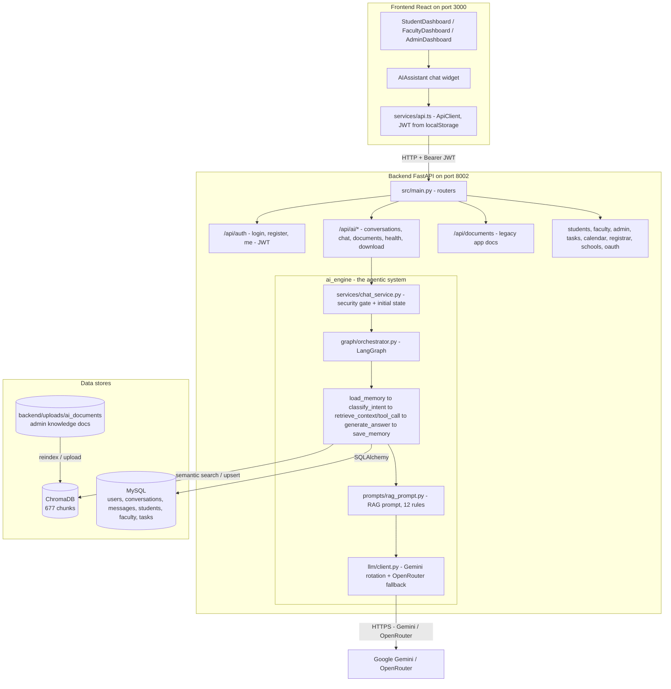

---

## A. End-to-End Chat Request

The frontend `AIAssistant` widget sends each message to the backend, which runs
the full agent pipeline and returns a *rich* `ai_message` (answer, confidence,
sources, follow-ups, download suggestions).

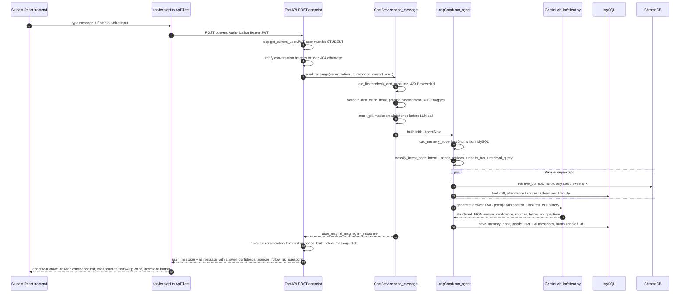

> **Failure handling:** `RateLimitExceeded` → HTTP 429, `PromptInjectionDetected`
> → HTTP 400, any other `AIEngineError` → 500 with a safe message ("AI processing
> failed"). The chatbot never hangs: LLM timeouts rotate models (see [Workflow H](#h-llm-call--model-fallback)).

---

## B. LangGraph Agent Pipeline

The graph is compiled **per request** (nodes are bound to a request-scoped DB
session via `functools.partial`) and reused by every agent run.

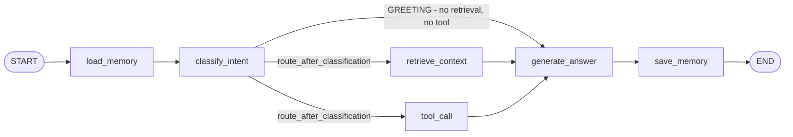

Routing logic (`graph/edges.py`):

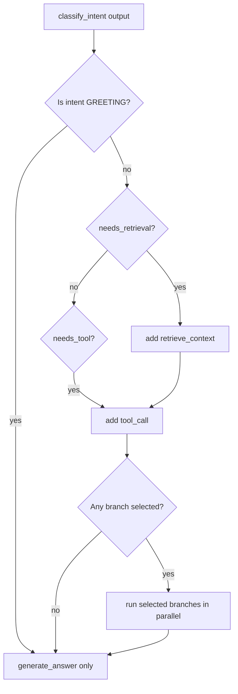

**Node responsibilities:**

| Node | File | Writes to state |
|---|---|---|
| `load_memory` | `agents/memory_manager.py` | `conversation_history` (last `MEMORY_WINDOW_SIZE=6` turns) |
| `classify_intent` | `agents/intent_classifier.py` + `agents/fast_intent.py` | `intent`, `intent_confidence`, `needs_retrieval`, `needs_tool`, `suggested_tool`, `retrieval_query` |
| `retrieve_context` | `agents/retriever.py` | `retrieval_result`, `retrieved_documents` |
| `tool_call` | `agents/tool_caller.py` | `tool_result` |
| `generate_answer` | `agents/answer_generator.py` | `agent_response` |
| `save_memory` | `agents/memory_manager.py` | `memory_saved`, `_saved_user_msg`, `_saved_ai_msg` |

> **Fast mode:** `FAST_RESPONSE_MODE` (default `False`) bypasses graph
> construction and runs the same nodes linearly. When a live tool result is
> *informative* (non-empty data beyond a stub `message`), retrieval is skipped —
> live student data wins. A stub tool result (e.g. `get_timetable` →
> "Timetable feature not yet implemented") is treated as **not informative**, so
> retrieval still runs. See [Parallel-Branch State Merge](#parallel-branch-state-merge).

---

## C. Intent Classification

Two tiers — deterministic local keyword routing first, Gemini only when needed.

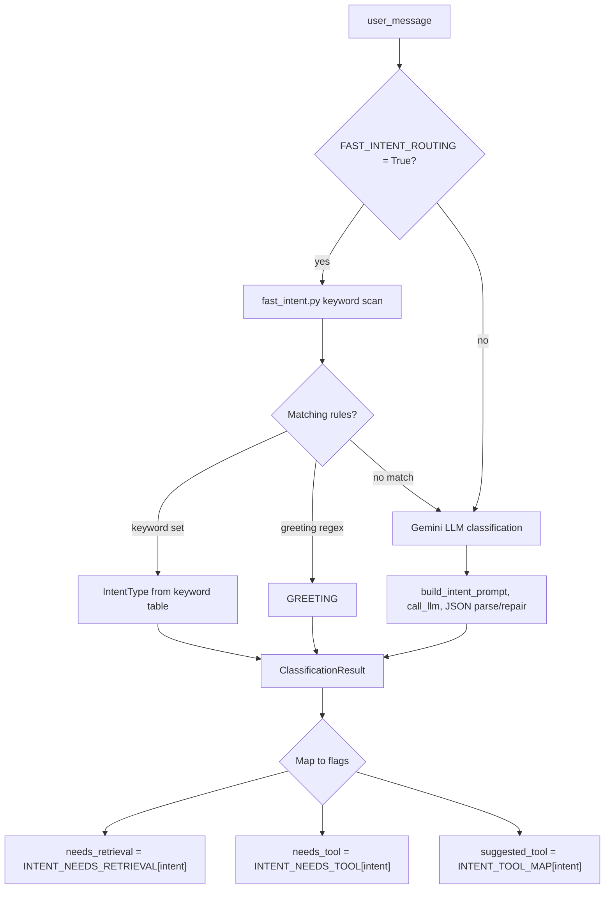

- **Intent types:** `course_query`, `attendance_query`, `placement_query`,
  `notice_query`, `faculty_query`, `exam_query`, `assignment_query`,
  `policy_query`, `timetable_query`, `general_academic`, `greeting`, `unknown`.
- **Retrieval** is enabled for all factual intents (incl. `unknown`), disabled for
  `greeting`/`general_academic`.
- **Tools** are enabled for `course_query`, `attendance_query`, etc. via
  `INTENT_TOOL_MAP` (e.g. `attendance_query` → `get_student_attendance`,
  `course_query` → `get_student_courses`).
- The LLM output is parsed defensively: markdown fences stripped, trailing commas
  removed, first `{...}` object extracted, unterminated JSON closed gracefully.

---

## D. RAG Knowledge Retrieval

This is the heart of the timetable fix and the richest workflow in the system.

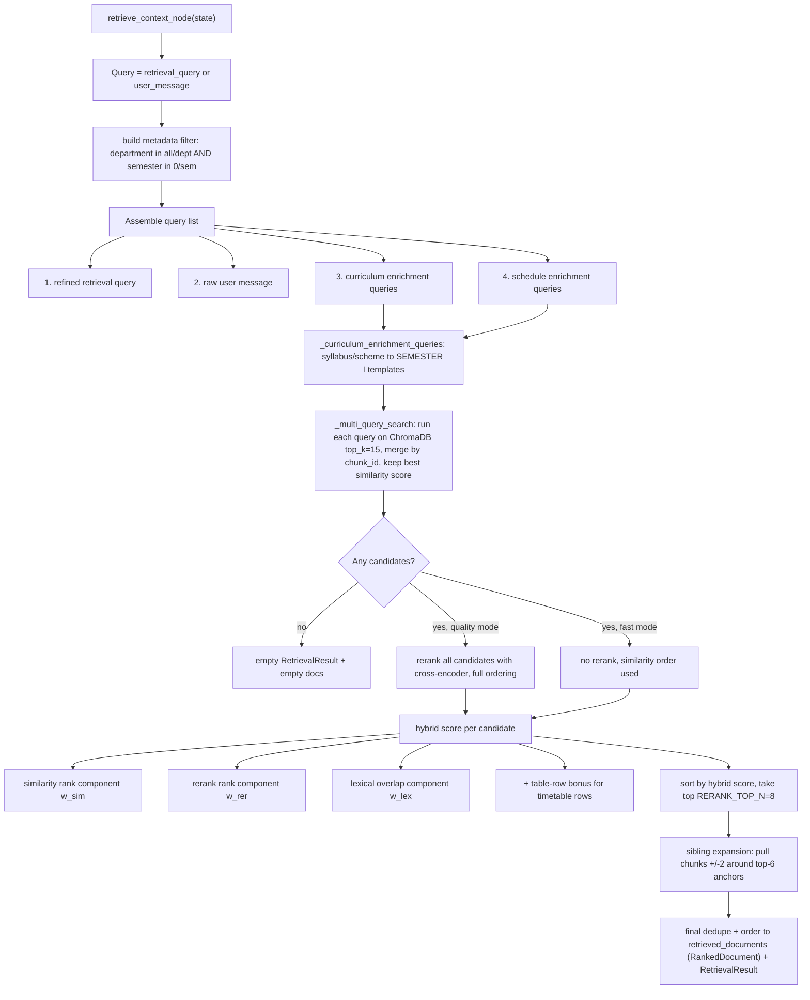

**Multi-query assembly** — the reason simple questions still find table data:

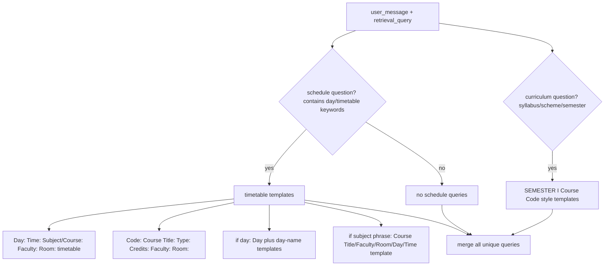

**Hybrid relevance score** (`_hybrid_score` in `retriever.py`):

```
score = 0.5 * (1 - sim_rank/total)     # similarity order
      + 0.3 * (1 - rerank_rank/total)  # cross-encoder order (0.0 in fast mode)
      + 0.2 * lexical_overlap          # best token overlap across ALL queries
      + table_row_bonus                # see below
```

**Table-row bonus (timetable fix):** when the question is a schedule question,
rows rendered from DOCX tables get a lift of `_TABLE_ROW_BONUS = 0.22` **only if**
the row looks like a labeled table row (**≥ 3 label hits** like `Day:`, `Time:`,
`Subject:`, `Room:`) **and** — when a subject phrase was detected — the row
contains **≥ 50% of the subject's tokens**. This prevents unrelated timetable
rows from crowding out the exact class the student asked about.

**Metadata filter fallback:** if the filtered search returns nothing, the search
is retried *without* the filter for a broader net.

**Sibling expansion:** the top-6 anchors bring their immediate neighbours
(±2 chunks) into the final set at a small score penalty (−0.05) — so a
"Scheme of Study" heading chunk always brings its course table along.

---

## E. Document Ingestion Pipeline

Admin uploads a document → it is extracted, cleaned, chunked, embedded and
upserted into ChromaDB, ready for retrieval.

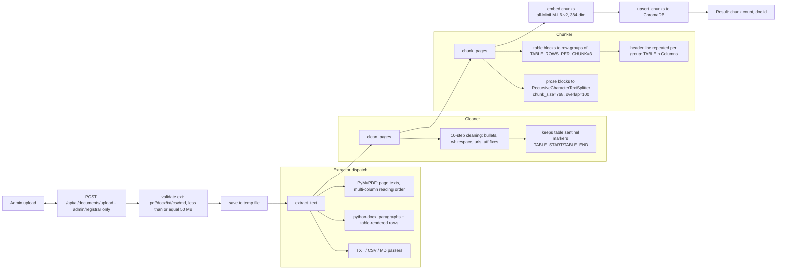

**Metadata stored per chunk:** `source_file`, `doc_type`, `department`,
`semester`, `academic_year`, `chunk_index`, `document_id`, `page_number`.

**Reindex path** (`backend/scripts/reindex_knowledge_base.py`):

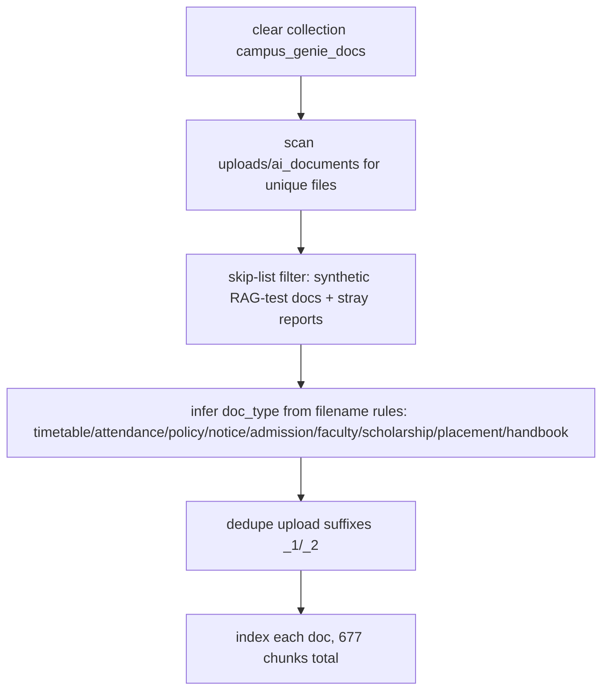

---

## F. Table-Aware DOCX Extraction

The core timetable fix: **raw DOCX tables are useless for vector search**
(`Wednesday | 09:00-10:00 | DBMS | ...` embeds poorly). The extractor rewrites
every table into **self-describing labeled rows** wrapped in sentinel markers so
the chunker can group them.

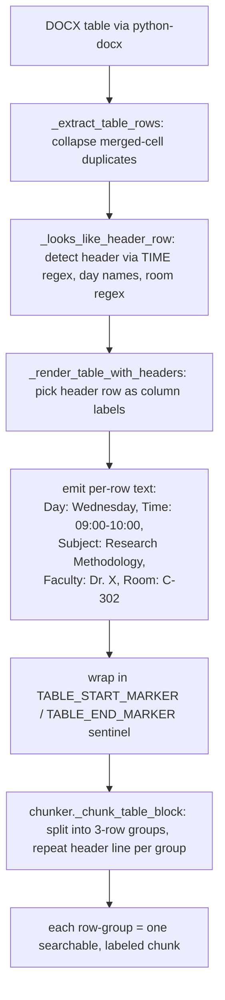

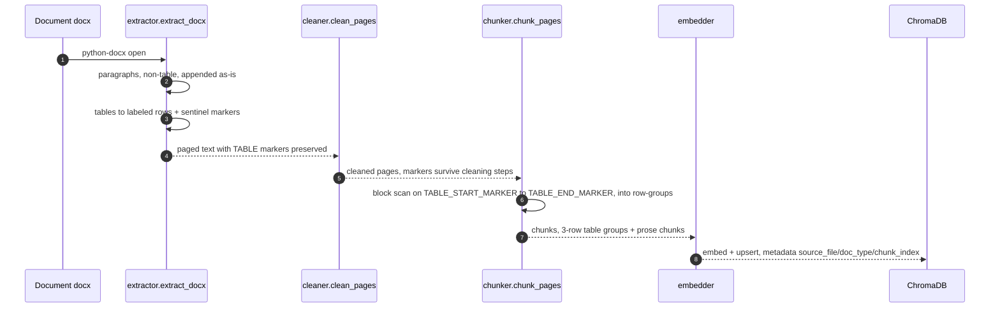

> **Why this fixes timetable RAG:** a row like
> `Day: Wednesday, Time: 09:00-10:00, Subject: Research Methodology, Faculty: ..., Room: ...`
> shares rich semantic and lexical overlap with "When is Research Methodology on
> Wednesday?" — the schedule enrichment queries plus the subject-gated row bonus
> push exactly that row to the top. Verified 16/16 timetable questions return the
> exact rows.

---

## G. Answer Generation

`generate_answer_node` builds the RAG prompt, calls the LLM, and parses the
strict JSON response.

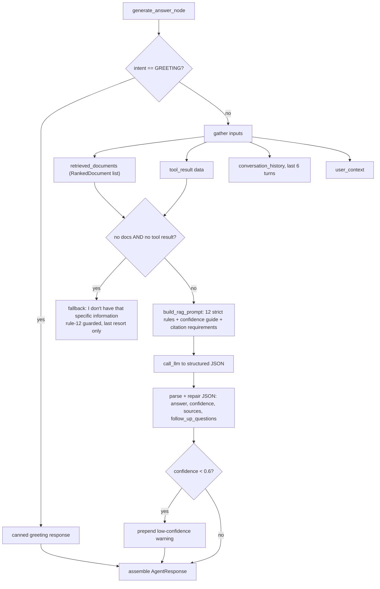

**RAG rules that matter (from `prompts/rag_prompt.py`):**

| # | Rule |
|---|---|
| 1 | Answer EXCLUSIVELY from retrieved context + tool results |
| 2 | If nothing relevant → exact "I don't have that specific information..." text |
| 3 | NEVER invent dates, marks, percentages, deadlines, names, phones, rooms, fees |
| 4 | ALWAYS cite exact source filenames — "According to [filename]" |
| 5 | Tool (live DB) data beats document context on conflict |
| 7–8 | No greeting, no restating the question — answer first |
| 12 | The "no information" response is the **last resort**: any partial grounding beats a refusal |

Response shape (single JSON object):

```json
{
  "answer": "…markdown answer with citations…",
  "confidence": 0.9,
  "sources": ["Master_Academic_Timetable.docx"],
  "follow_up_questions": ["…", "…", "…"]
}
```

---

## H. LLM Call & Model Fallback

Every LLM interaction goes through `llm/client.py`. Resilience chain:
**same-model retry → rotate through Gemini fallback models → OpenRouter HTTP fallback**.

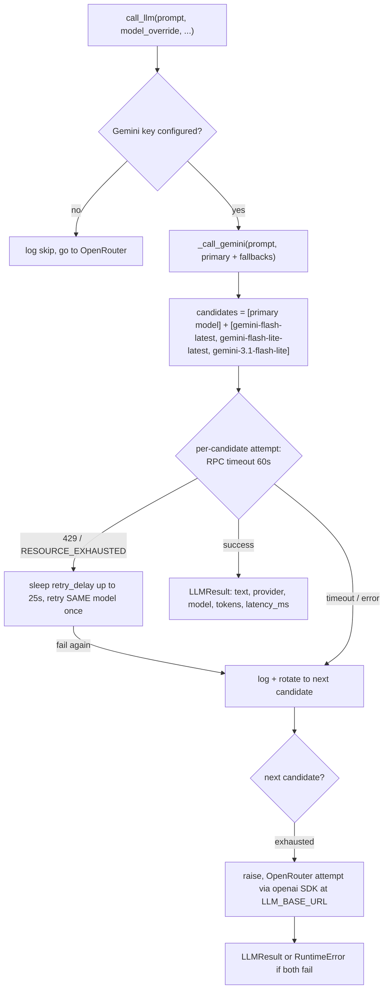

> Each free-tier Gemini model caps at ~20 requests/day. Rotation keeps the bot
> online when the day bucket is exhausted; a 429 with a short retry delay is
> retried on the same model first (per-minute cap), then rotates.

---

## I. Memory Persistence

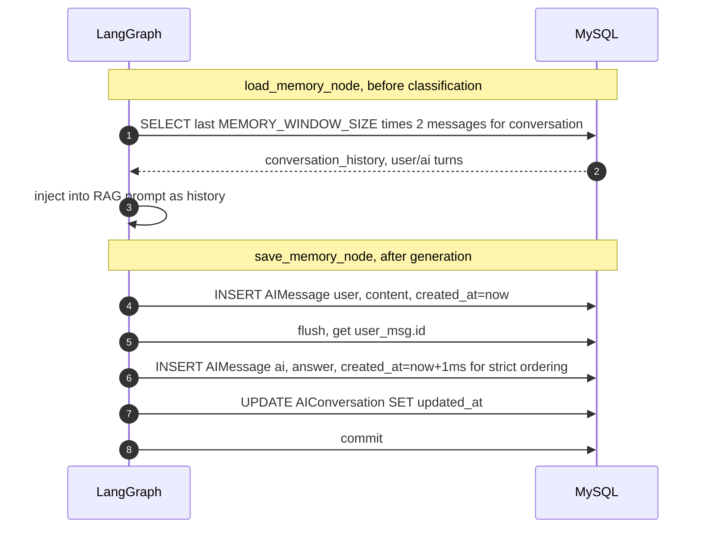

**Ordering trick:** the AI reply is stamped `now + 1ms` so `(created_at, id)`
always places the user message before the AI reply, even with second-resolution
DB clocks.

---

## J. Conversation Lifecycle

API endpoints under `/api/ai` (`ai_engine/api/ai_routes.py`):

| Method | Path | Purpose |
|---|---|---|
| POST | `/api/ai/conversations` | create conversation (auto-titled) |
| GET | `/api/ai/conversations` | list user's conversations |
| GET | `/api/ai/conversations/{id}` | conversation + messages |
| POST | `/api/ai/conversations/{id}/messages` | **send message (main chat)** |
| DELETE | `/api/ai/conversations/{id}` | delete conversation |
| POST | `/api/ai/chat` | stateless quick chat (temp conversation) |
| POST | `/api/ai/download` | export AI content |
| POST | `/api/ai/detect-download` | suggest downloadable formats |

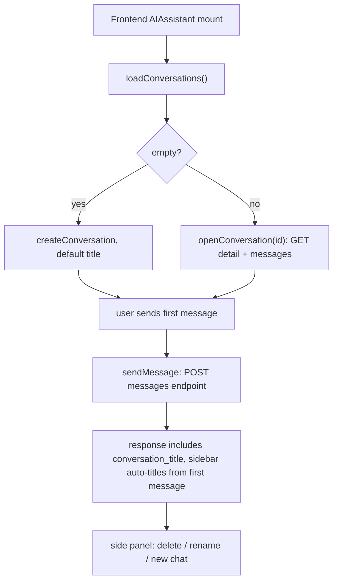

---

## K. Document Management

Admin/registrar only (role check → 403 otherwise).

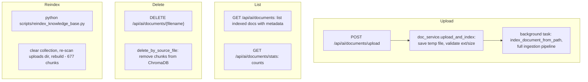

---

## L. Auth & Authorization

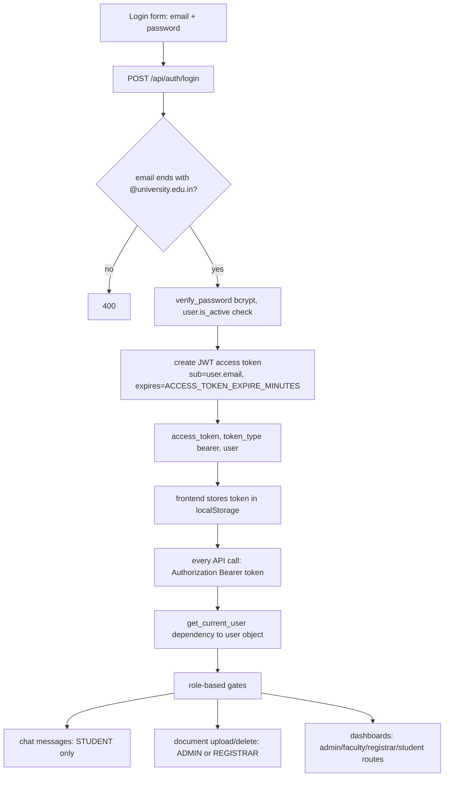

Registration (`POST /api/auth/register`) hashes the password via bcrypt and stores
a `User` with a role. Frontend routing in `AppRoutes.tsx`:
`!isAuthenticated → AuthPage`, then admin → AdminDashboard, registrar →
RegistrarDashboard, staff → FacultyDashboardNew, else StudentDashboard.

---

## M. Download / Export

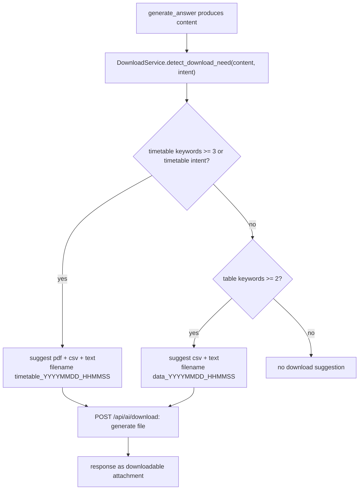

---

## Parallel-Branch State Merge

*(The decisive bug fix for timetable RAG.)*

`retrieve_context` and `tool_call` run in **parallel** in LangGraph. Each branch
re-emits the whole state; the branch that finishes last would carry
`retrieved_documents: None` (from the input state) for keys it didn't produce.
With default last-write-wins this **clobbered the real retrieved docs**, so
timetable questions (which need *both* retrieval and tools) reached the answer
generator with **zero documents** → "I don't have that information".

`AgentState` (`schemas/agent_state.py`) fixes this with custom reducers:

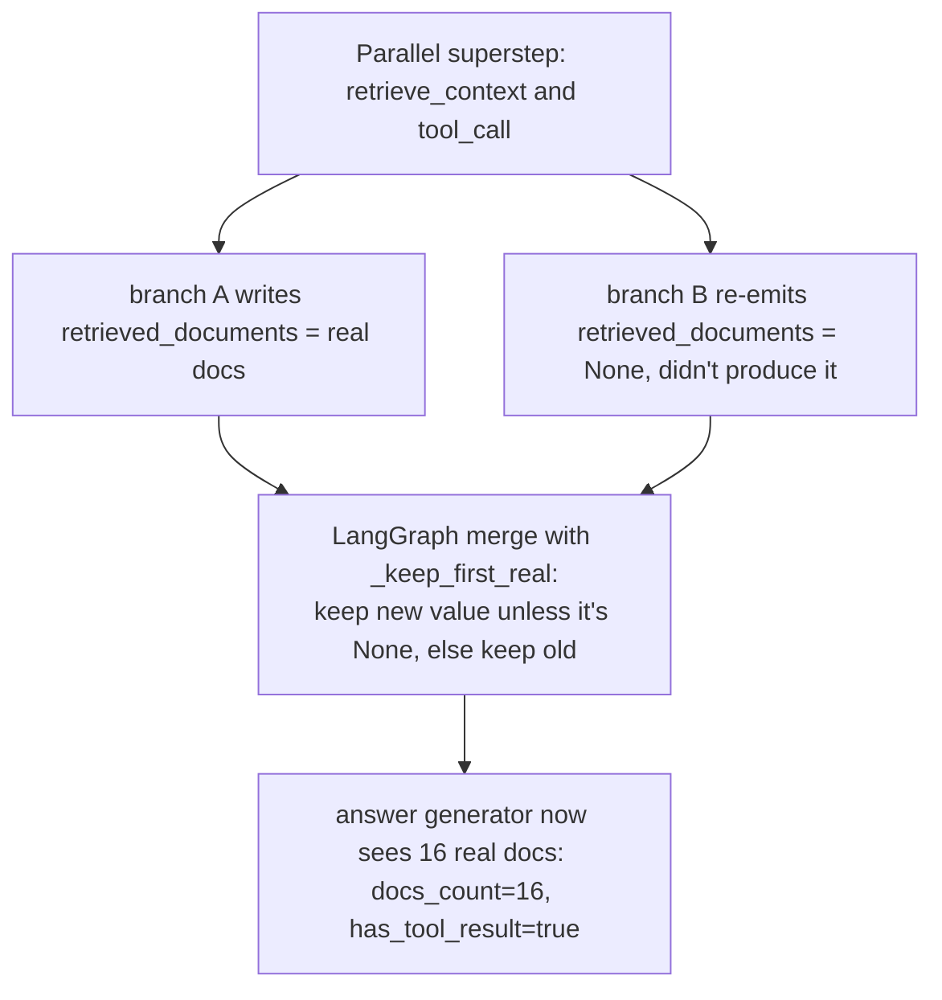

| Reducer | Applies to | Behaviour |
|---|---|---|
| `_keep_last` | input & classification fields | last-write-wins, no conflict |
| `_keep_first_real` | `retrieved_documents`, `retrieval_result`, `tool_result` | keep the *populated* value; a stale `None` cannot clobber a real result |
| `_trace_reducer` | `execution_trace` | prefix-aware append — avoids exponential duplication from `operator.add` while preserving parallel branch entries |

---

## Observability & Health

- **Health endpoint** `GET /api/ai/health` checks embedding model (dim=384),
  ChromaDB chunk count (677), and Gemini key presence; returns 503 on degradation.
- **Startup warmup:** embedding model, ChromaDB and the reranker are loaded at
  startup via a thread pool so the first request is fast; prints
  `✅ AI Engine ready | Embedding dim: 384 | ChromaDB chunks: 677`.
- **Structured logging:** every node logs `event` entries
  (`orchestrator.run.start`, `retriever.done`, `answer.generate.start`,
  `memory.save.done`, `llm.call.gemini.rate_limited`, …) with `trace_id` and
  latencies via `Timer`.
- **LangSmith tracing:** optional — enabled when `ENABLE_LANGSMITH_TRACING` +
  `LANGSMITH_API_KEY` are set (env vars injected before any langgraph import).
- **Rate limiting:** 60/min, 20 burst, 1000/day per user (`core/security.py`).

**Diagnostic recipe without burning Gemini quota:**

```python
# 1) Standalone embedding similarity
model.encode("When is Advanced DBMS class?").tolist()
vs.collection.query(query_embeddings=..., n_results=10)

# 2) Full retrieval node
retrieve_context_node({
  "user_message": "...", "retrieval_query": "...",
  "user_context": {...}, "trace_id": "...", "needs_retrieval": True,
})
# inspect state["retrieved_documents"][i].content / .metadata.source_file / .similarity_score
```

---

## Configuration Reference

Key knobs (`backend/ai_engine/core/config.py`, overridable via `backend/.env`):

| Setting | Default | Meaning |
|---|---|---|
| `GEMINI_CHAT_MODEL` | `gemini-3.5-flash` | answer generation model |
| `GEMINI_FAST_MODEL` | `gemini-3.1-flash-lite` | intent classification / fast path |
| `GEMINI_FALLBACK_MODELS` | `gemini-flash-latest`, `gemini-flash-lite-latest`, `gemini-3.1-flash-lite` | rotation on 429/timeout |
| `GEMINI_TIMEOUT_SECONDS` | 60 | hard per-call timeout |
| `CHROMA_COLLECTION_NAME` | `campus_genie_docs` | vector collection |
| `RETRIEVAL_TOP_K` | 15 | candidates from ChromaDB |
| `RERANK_TOP_N` | 8 | docs reaching the LLM (quality mode) |
| `FAST_RETRIEVAL_TOP_K` | 3 | docs reaching the LLM (fast mode) |
| `CHUNK_SIZE` / `CHUNK_OVERLAP` | 768 / 100 | prose text splitting |
| `TABLE_ROWS_PER_CHUNK` | 3 | docx table rows per chunk |
| `MAX_CONTEXT_CHARS_PER_DOCUMENT` | 1200 | per-chunk context cap in prompt |
| `MEMORY_WINDOW_SIZE` | 6 | conversation turns loaded |
| `EMBEDDING_MODEL_NAME` | `all-MiniLM-L6-v2` | 384-dim local embeddings |
| `RERANKER_MODEL_NAME` | `cross-encoder/ms-marco-MiniLM-L-6-v2` | local reranker |
| `FAST_RESPONSE_MODE` | `False` | quality vs fast path |
| `FAST_INTENT_ROUTING` | `True` | local keyword intent routing first |
| `RATE_LIMIT_PER_MINUTE/DAY/BURST` | 60 / 1000 / 20 | user throttling |
| `ALLOWED_DOCUMENT_EXTENSIONS` | pdf, docx, txt, csv, md | uploads |

---

## Services / Ports

| Service | How to start | URL |
|---|---|---|
| Backend (FastAPI) | `cd backend && PYTHONPATH=src nohup /opt/homebrew/bin/python3.11 -m uvicorn src.main:app --host 0.0.0.0 --port 8002` | http://localhost:8002 |
| API docs (Swagger) | — | http://localhost:8002/docs |
| AI health | — | http://localhost:8002/api/ai/health |
| Frontend (React) | `cd frontend && npm start` | http://localhost:3000 |
| KB reindex | `cd backend && PYTHONPATH=.. python3.11 scripts/reindex_knowledge_base.py` | → 677 chunks |

**Demo login:** `student@university.edu.in` / `student123`

---

*Diagrams in this file reflect the committed state at `main` (`0341910`).
Generated from the live codebase — `backend/ai_engine/**`, `backend/src/**`, and
`frontend/src/**`.*
